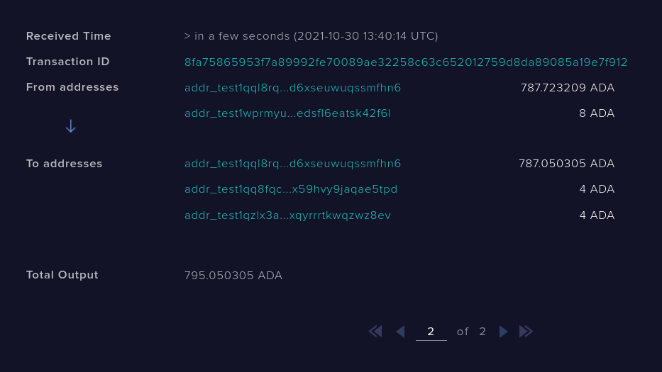
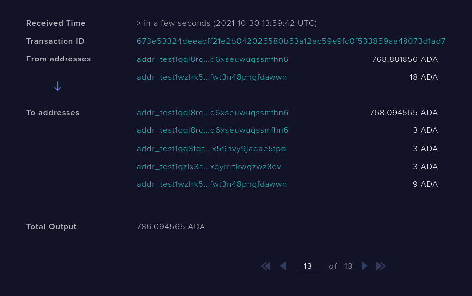

# Distributor Guide

In order to facilitate the testing of the distribution script, I decided to make a
python wrapper around cardano-cli. After that, I made six functions, each one
testing a different scenario I thought could show script vulnerabilities.

## Table Of Contents
* [Setup](#setup)
* [First Scenario](#first-scenario)
* [Second Scenario](#second-scenario)
* [Third Scenario](#third-scenario)
* [Fourth Scenario](#fourth-scenario)
* [Fifth Scenario](#fifth-scenario)
* [Sixth Scenario](#sixth-scenario)

## Setup

Before moving into the scenarios and how to try them in the testnet, make sure that
cardano-node and cardano-cli are installed

```bash
cardano-node --version
```

```bash
cardano-cli --version
```

If they are not, you may follow the intructions
[here](https://docs.cardano.org/getting-started/installing-the-cardano-node).

After you made sure both executables are installed, run cardano node in the
testnet mode. The following is the command I run, but depending on how you
installed cardano-node, your command may look different

```bash
cardano-node run \
    --topology testnet-topology.json \
    --database-path db \
    --socket-path node.socket \
    --host-addr 0.0.0.0 \
    --port 3001 \
    --config testnet-config.json \
```

After this, take a look at "data/info.json" and insert the information you will
use. For the scenarios to work you need three users: "alice", "bob" and
"charlie". The "path" argument from each user is a folder where the keys and
address from the specific user are located ("payment.addr", "payment.vkey",
"payment.skey"). They should all have the name "payment" and be located at
individual folders.

If you don't know how to generate keys, take a look at
[this guide](https://cardano-foundation.gitbook.io/stake-pool-course/stake-pool-guide/stake-pool-operations/keys_and_addresses).
Also, make sure that Alice has a reasonable amount of tADA, since we'll be using
that a lot. You can get some free tADA in
[this page](https://testnets.cardano.org/en/testnets/cardano/tools/faucet/).


Finally, we can start to run our scenarios

## First scenario

In the first scenario, Alice sends 9 ADA to the script with the distribution
`{Alice: 1, Bob: 1, Charlie: 1}` (meaing each one will receive a third) and a
minimum UTxO value of 1 ADA. Then Alice consumes the script, giving 3 ADA to
herself, 3 ADA to Bob and 3 ADA to Charlie. Because the distribution is correct,
the transaction should validate.

This scenario will show us that simple distributions are indeed working.

Before running it, make sure the node is running and is synchronized with the
testnet.

```bash
cardano-cli query tip --tesnet-magic 1097911063
```

Should return something like this
```bash
{
    "epoch": 165,
    "hash": "fdc6793a20200de88c70436925eeca6713e509bc73553fcf959db3024e666231",
    "slot": 41225803,
    "block": 3032237,
    "era": "Alonzo",
    "syncProgress": "100.00"
}
```

If "syncProgress" is 100%, it means the node is synchornised, otherwise, you
need to wait some time.

To start, run the following command

```bash
python3 scenarios.py 1
```

After executing the command, you could see a message like this

```
Script not empty, calling function to empty addr_test1wzlrk5ra8pts700jczd44jg328zpz7mjjc7wqfwt3n48pngfdawwn
Transaction successfully submitted.
Please restart the node to update the script balance
```

Every time you see this, it means that the script already had ADA inside, so the
program will distribute it accordingly, leaving it without any tokens so we can
simulate our scenario correctly.

You can also see that it asks you to restart the node. This will be very common
in the next steps because apparantly the node doesn't update it's own ledger
after submitting a transaction and only does it after restarted.

If this doesn't happen to your node, though, you can simply move on. Otherwise,
stop the node and start it again every time you see this message. It's also
ideal that you wait a while before you stop the node, so that it has some time
to broadcast the transaction.

If you don't see any of that, good, it means that the script was already empty.

After "cleaning" the script, you should see the following message

```
Transaction successfully submitted.
9 ADA sent from Alice to addr_test1wzlrk5ra8pts700jczd44jg328zpz7mjjc7wqfwt3n48pngfdawwn
Please restart the node to update the script balance
```

You can confirm that the transaction was submitted, by looking at
[testnet explorer](https://explorer.cardano-testnet.iohkdev.io). Sometimes it
takes 30 seconds, some times it's pretty fast, just make sure that it shows
a balance of 9 ADA.

If you do, restart the node and, after some time, you'll see the following
message

```
Transaction successfully submitted.
Alice tried to consume the script, giving 3 ADA to herself, 3 ADA to Bob and 3 ADA to Charlie
Transaction should succeed
```

Wait 20-30 seconds again and look in the testnet for the last transaction related
to our script, it should show something like this


Congratulations, the script works (at least it's basic functionality).

Restart the node for the next scenario.

## Second Scenario

In the second scenario, Alice sends 9 ADA to the script with the same paramaters
as in the first scenario, the difference is that now Alice tries to transfer all
the tokens to herself (instead of distributing it). Of course, the script
validator should fail.

This scenario will show us that the script is "guarding" the transaction and not
allowing wrong distributions.

As in the first case, make sure the node is 100% synced and that it was
restarted after the last scenario transaction submission.

To start, run the following command

```bash
python3 scenarios.py 2
```

You should, again, see the following message

```
Transaction successfully submitted.
9 ADA sent from Alice to addr_test1wzlrk5ra8pts700jczd44jg328zpz7mjjc7wqfwt3n48pngfdawwn
Please restart the node to update the script balance
```

After confirming the transaction in the testnet explorer and restarting the
node, you should see the following message

```
Command failed: transaction build  Error: The following scripts have execution failures:
the script for transaction input 1 (in the order of the TxIds) failed with The Plutus sc
ript evaluation failed: An error has occurred:  User error:
The provided Plutus code called 'error'.
```

and you should see a "Transaction build failed" exception. It meas Alice wasn't
able to put her plan in practice and the transaction she made failed.

## Third Scenario

In the third scenario, Alice sends 9 ADA to the script with the same distribution
as in the other scenarios, but with a minimum UTxO value of 4 ADA. Then Alice
tries to consume the script, giving 3 ADA to herself, 3 ADA to Bob and 3 ADA to
Charlie. This should, of course, fail, since the values distributed are below
the minimum threshold.

Execute

```bash
python3 scenarios.py 3
```

After following the script instructions and restarting the node every time it
asked you to (after making sure the balance in the tesnet was correct), you
should see the final result

```
Command failed: transaction build  Error: The following scripts have execution failures:
the script for transaction input 1 (in the order of the TxIds) failed with The Plutus script evaluation failed: An error has occurred:  User error:
The provided Plutus code called 'error'.
```

It means the transaction failed (exactly what we wanted to happen).

## Fourth scenario

In the fourth scenario, Alice, Bob and Charlie send 3 ADA each to the script
with the same parameters as in the first and second scenarios. Then, Alice
consumes the script, distributing it correctly (3 ADA to herself, 3 ADA to Bob
and 3 ADA to Charlie).

This scenario should show us that it doesn't matter if we are cosuming one or
multiple UTxOs from the script, it should validate.

Execute

```bash
python3 scenarios.py 4
```

After following the steps, restarting the node when asked, you should see the
following

```
Alice tried to consume the script, giving 3 ADA to herself, 3 ADA to Bob and 3 ADA to Charlie
Transaction should work
```

And the last transaction from the testnet should be something like this


Restart the node to proceed to the next scenario

## Fifth scenario

In the fifth scenario, Alice sends 8 ADA to the script with the distribution
`{Bob: 1, Charlie: 1}` (meaning Bob and Charlie should receive one half each)
and a minimum UTxO value of 1 ADA. Then Alice consumes the script,
giving 4 ADA to Bob and 4 ADA to Charlie.

This scenario should show that a user doesn't need to be a distributor to send
ADA to the script or distribute it's value as long as the distribution is
followed and the minimum UTxO value is exceeded.

Execute

```bash
python3 scenarios.py 5
```

After following the steps you should see

```
Transaction successfully submitted.
Alice tried to consume the script, giving 4 ADA to Bob and 4 ADA to Charlie
```

And the tesnet explorer should look something like this



## Sixth Scenario

In the sixth scenario, Alice sends 18 ADA to the script with the same parameters
as the first and second scenarios. Then, Alice consumes the script, giving 3 ADA
to herself, 3 ADA to Bob and 3 ADA to Charlie and keeping 9 ADA at the script.

This scenario should show that not all the value stored inside the script must
be distributed, anyone may distribute only a fraction, as long as, the
proportion of the receivers amount stays the same (in this case 1/3, 1/3 and
1/3) and the minimum utxo value is exceeded.

Execute

```bash
python3 scenarios.py 6
```

After following the steps you should see

```
Transaction successfully submitted.
Alice tried to consume the script, giving 3 ADA to herself, 3 ADA to Bob, 3 ADA to Charlie and keeping 9 ADA in the script
```

And the tesnet explorer should look something like this

