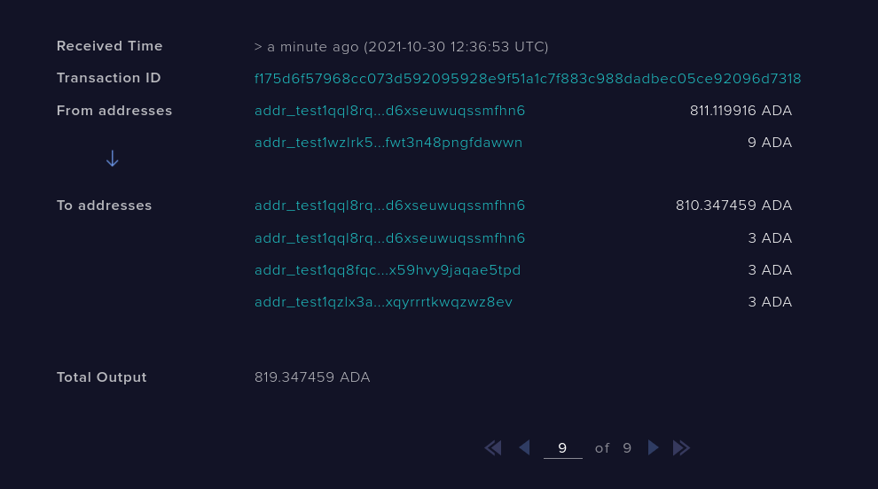
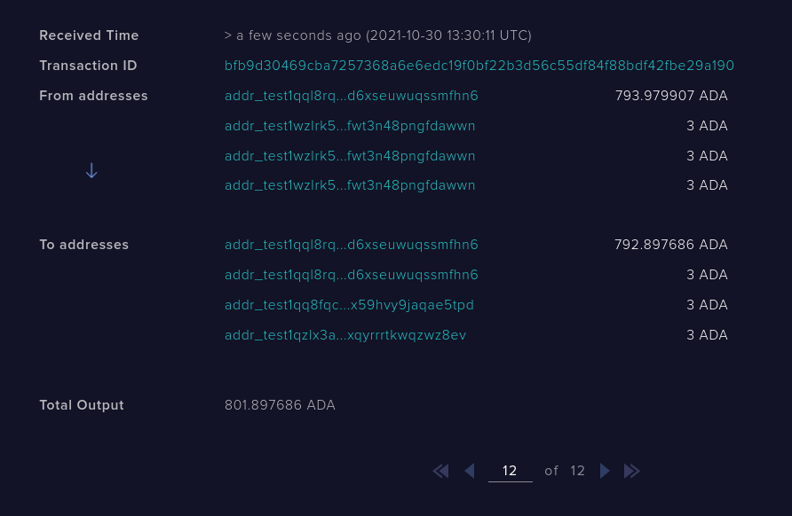

# Distributor Guide

In order to facilitate the testing of the distribution script, I decided to make a
python wrapper around cardano-cli. After that, I made six functions, each one
testing a different scenario I thought could show script vulnerabilities.

Before moving into the scenarios and how to try them in the testnet, make sure that
cardano-node and cardano-cli are installed

```bash
cardano-node --version
```

```bash
cardano-node 1.30.1 - linux-x86_64 - ghc-8.10
git rev 0fb43f4e3da8b225f4f86557aed90a183981a64f
```

```bash
cardano-cli --version
```

```bash
cardano-cli 1.30.1 - linux-x86_64 - ghc-8.10
git rev 0fb43f4e3da8b225f4f86557aed90a183981a64f
```

If they are not, you may follow the intructions
[here](https://docs.cardano.org/getting-started/installing-the-cardano-node).

After you made sure both executables are installed, run cardano node in the
testnet mode. The following is the command I run, but depending on how you
installed cardano-node, your command may look different

```bash
cardano-node run \
    --topology testnet-topology.json \
    --database-path db \
    --socket-path node.socket \
    --host-addr 0.0.0.0 \
    --port 3001 \
    --config testnet-config.json \
```

After this, take a look at "data/info.json" and insert the information you will
use. For the scenarios to work you need three users: "alice", "bob" and
"charlie". The "path" argument from each user is a folder where the keys and
address from the specific user are located ("payment.addr", "payment.vkey",
"payment.skey"). They should all have the name "payment" and be located at
individual folders.

Finally, we can start to run our scenarios

## First scenario

In the first scenario, Alice sends 9 ADA to the script with the distribution
`{Alice: 1, Bob: 1, Charlie: 1}` (meaing each one will receive a third) and a
minimum UTxO value of 1 ADA. Then Alice consumes the script, giving 3 ADA to
herself, 3 ADA to Bob and 3 ADA to Charlie. Because the distribution is correct,
the transaction should validate.

This scenario will show us that simple distributions are indeed working

Before running it, make sure the node is running and is synchronized with the
testnet.

```bash
cardano-cli query tip --tesnet-magic 1097911063
```

```bash
{
    "epoch": 165,
    "hash": "fdc6793a20200de88c70436925eeca6713e509bc73553fcf959db3024e666231",
    "slot": 41225803,
    "block": 3032237,
    "era": "Alonzo",
    "syncProgress": "100.00"
}
```

If "syncProgress" is 100%, it means the node is synchornised, otherwise, you
need to wait some time.

To start, run the following command

```bash
python3 scenarios.py 1
```

After executing the command, you should either see a message saying that the
script was not empty

```
Script not empty, calling function to empty addr_test1wzlrk5ra8pts700jczd44jg328zpz7mjjc7wqfwt3n48pngfdawwn
Transaction successfully submitted.
Please restart the node to update the script balance
```

or that 9 ADA were sent from Alice to the script

```
Transaction successfully submitted.
9 ADA sent from Alice to addr_test1wzlrk5ra8pts700jczd44jg328zpz7mjjc7wqfwt3n48pngfdawwn
Please restart the node to update the script balance
```

In both cases it will be asked to restart the node (if the transaction was
successful) so the node can update it's information. To make sure the
transaction was submitted, you should wait 20-30 seconds and search for the
script address in the [testnet explorer](https://explorer.cardano-testnet.iohkdev.io)

If you see that the balance of the script is 0 ADA in the first case or 9 ADA in
the second, it worked and you should restart the node.

After the node is restarted, there could be a 20 seconds dealay, but you should
receive the following message

```
Transaction successfully submitted.
Alice tried to consume the script, giving 3 ADA to herself, 3 ADA to Bob and 3 ADA to Charlie
Transaction should succeed
```

Wait 20-30 seconds again and look in the testnet for the last transaction related
to our script, it should show something like this



You should, again, restart the node.

## Second Scenario

In the second scenario, Alice sends 9 ADA to the script with the distribution
nd minimum UtxO value stays the same as in the first scenario, the difference is
that now Alice thinks she's really smart, so she'll try to grab all the
deposited tokens to herself (instead of distributing it). Of course, the script
validator should fail the transaction.

This scenario will show us that the script is "guarding" the transaction and not
allowing wrong distributions

As in the first case, make sure the node is 100% synced and that it was
restarted after the last scenario transaction submission.

To start, run the following command

```bash
python3 scenarios.py 2
```

You should, again, see the following message

```
Transaction successfully submitted.
9 ADA sent from Alice to addr_test1wzlrk5ra8pts700jczd44jg328zpz7mjjc7wqfwt3n48pngfdawwn
Please restart the node to update the script balance
```

And, after you confirmed in the testnet explorer that the transaction was
successful, you should restart the node.

Finally after you restarted the node and some time has passed, you should see
the following message

```
Alice will try to consume the script, giving 9 ADA to herself. Since this is the wrong d
istribution, you should receive an exception.
Command failed: transaction build  Error: The following scripts have execution failures:
the script for transaction input 1 (in the order of the TxIds) failed with The Plutus sc
ript evaluation failed: An error has occurred:  User error:
The provided Plutus code called 'error'.
```

and you should see a "Transaction build failed" exception. It meas Alice wasn't
able to put her devious plan in practice

## Third Scenario

In the third scenario, Alice sends 9 ADA to the script with the same distribution
as the other scenarios, but with a minimum UTxO value of 4 ADA. Then Alice
tries to consume the script, giving 3 ADA to herself, 3 ADA to Bob and 3 ADA to
Charlie. This should, of course, fail, since the values distributed are below
the minimum threshold.

Execute

```bash
python3 scenarios.py 3
```

After following the script instructions and restarting the node every time it
asked you to (after making sure the balance in the tesnet was correct), you
should see the final result

```
Alice will try to consume the script, giving 3 ADA to herself, 3 ADA to Bob and 3 ADA to Charlie. Since this is below the minimum UTxO value, the transaction should fail, throwing an exception
Command failed: transaction build  Error: The following scripts have execution failures:
the script for transaction input 1 (in the order of the TxIds) failed with The Plutus script evaluation failed: An error has occurred:  User error:
The provided Plutus code called 'error'.
```

It means the transaction failed (exactly what we wanted to happen).

## Fourth scenario

In the fourth scenario, Alice, Bob and Charlie send 3 ADA each to the script
with the same parameters as in the first and second scenarios. Then, Alice
consumes the script, distributing it correctly (3 ADA to herself, 3 ADA to Bob
and 3 ADA to Charlie).

This scenario should show us that it doesn't matter if we are cosuming one or
multiple UTxOs from the script, it should validate.

Execute

```bash
python3 scenarios.py 4
```

After following the steps, restarting the node when asked, you should see the
following

```
Alice tried to consume the script, giving 3 ADA to herself, 3 ADA to Bob and 3 ADA to Charlie
Transaction should work
```

And the last transaction from the testnet should be something like this



Restart the node to proceed to the next scenario